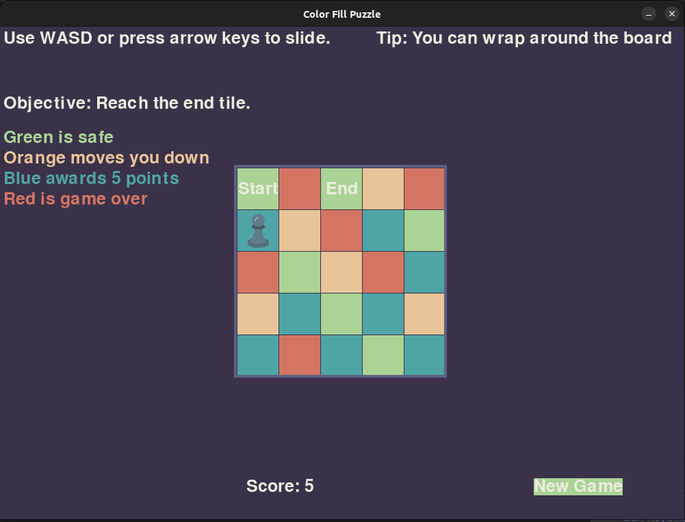

# Color Fill Puzzle

A simple yet fun sliding puzzle game developed using Python's Pygame library. The goal of the game is to reach the end tile while avoiding obstacles, scoring points, and avoiding the "Game Over" state. The game incorporates a wrap-around board feature and various tile effects.



## Features

- **Dynamic Puzzle Board**: A 5x5 grid with tiles that have different effects:
  - **🟩 Green Tile**: Safe and does nothing.
  - **🟦 Blue Tile**: Awards 5 points when stepped on.
  - **🟥 Red Tile**: Ends the game immediately.
  - **🟧 Orange Tile**: Moves the player down.
  - **⏹️ End Tile**: Reach this tile to win the game.
- **Wrap-Around Mechanism**: The player can move off one edge of the grid and reappear on the opposite edge.
- **Player Movement**: Move using the arrow keys or WASD keys.
- **Score Tracking**: Players can accumulate points by stepping on blue tiles.
- **Game Restart & Quit Options**: The game can be reset or quit using keyboard keys.

## Installation

1. Make sure you have Python 3.8+ installed on your system.
2. Install the required dependencies:
   ```bash
   pip install pygame
3. Clone the repository:
   ```bash
   git clone https://github.com/yourusername/color-fill-puzzle.git
5. Run the game:
   ```bash
   python main.py

## How to Play
 - ⏹️ Objective: Reach the "End Tile" (green tile marked "End").
 - 🕹️ Use the arrow keys or WASD keys to move the player across the board.
 - 🟩 Stepping on the green tile does nothing.
 - 🟦 Stepping on the blue tile awards 5 points.
 - 🟥 Stepping on the red tile results in "Game Over".
 - 🟧 Stepping on the orange tile moves you down the board.


